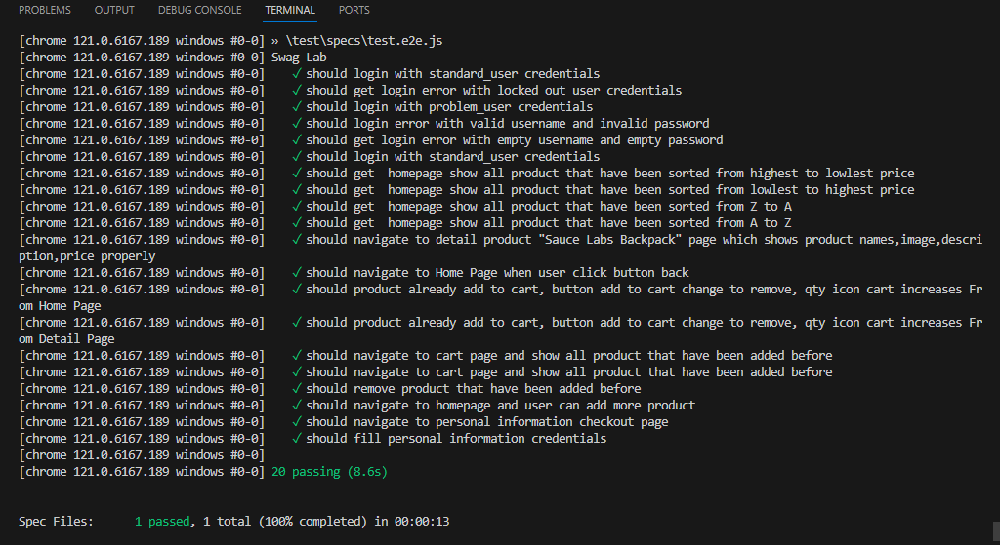

# Web Automation using WebdriverIo

## Prerequisites

Before running the tests, ensure you have the following installed:

- Node.js
- npm global

## Instalassion
#### Install dependencies
NodeJS >= v16.x.x (https://nodejs.org/en/download)  
Global NPM (npm install npm -g)

## HOW to Run
npm run wdio

## Report FILE

